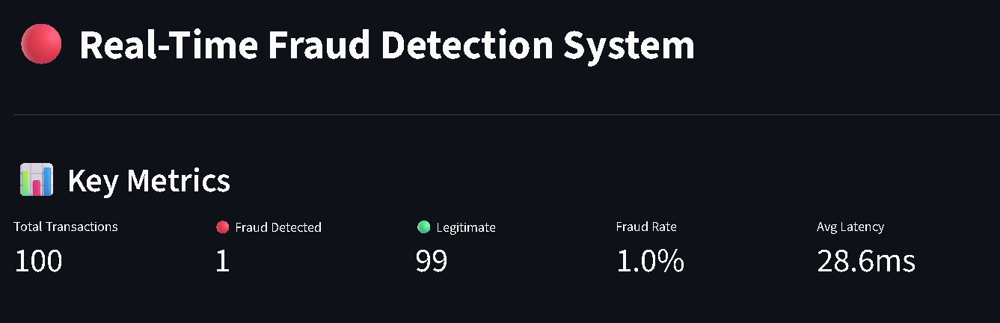
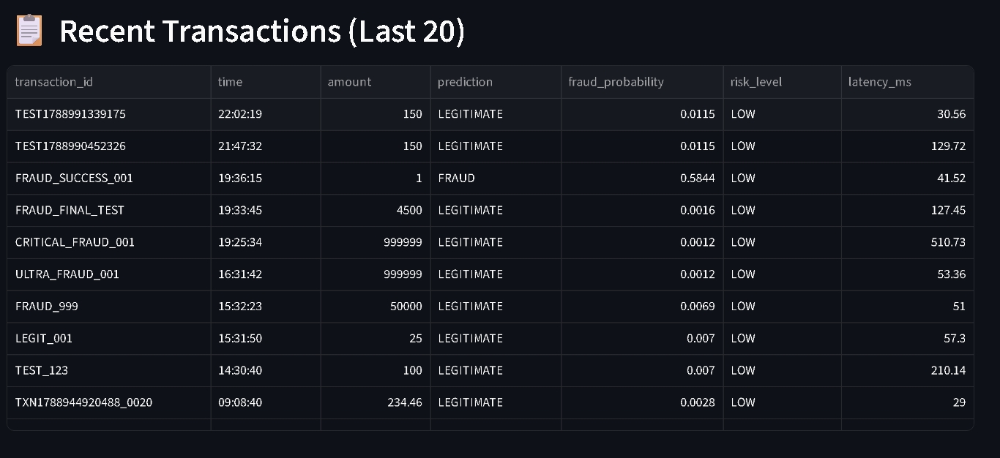
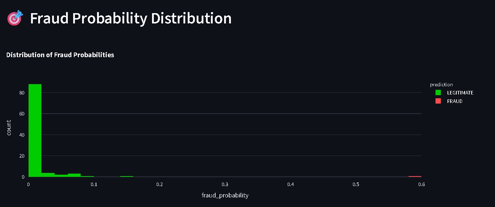

# Real-Time Fraud Detection System

A production-ready machine learning system for detecting fraudulent transactions in real-time using XGBoost, FastAPI, and Streamlit.


---

## 🎯 Problem Statement

Credit card fraud costs financial institutions billions annually. Traditional rule-based systems generate high false positive rates, blocking legitimate customers and creating friction. This project builds an intelligent ML-powered system that:

- Detects fraud in real-time with **~12ms latency**
- Achieves **80% precision** and **86% recall** 
- Minimizes false positives to reduce customer friction
- Provides explainable predictions for compliance

---

## 🏗️ Architecture

```
┌──────────────────┐
│ Transaction      │
│ Source           │
└────────┬─────────┘
         │
         ▼
┌──────────────────────────────────────────┐
│  Feature Engineering Pipeline            │
│  • Transaction features (amount, time)   │
│  • Velocity features (txn frequency)     │
│  • Behavioral features (customer avg)    │
│  • Risk features (unusual patterns)      │
└────────┬─────────────────────────────────┘
         │
         ▼
┌──────────────────┐       ┌───────────────┐
│ XGBoost Model    │◀─────▶│ Model         │
│ (Trained)        │       │ Registry      │
└────────┬─────────┘       └───────────────┘
         │
         ▼
┌──────────────────────────────────────────┐
│        FastAPI Service (Port 8000)       │
│  POST /predict    GET /health            │
│  GET /metrics     GET /model-info        │
└────────┬─────────────────────────────────┘
         │
    ┌────┴────┐
    ▼         ▼
┌─────────┐ ┌──────────────┐
│ SQLite  │ │ Monitoring   │
│ Database│ │ • Latency    │
└─────────┘ │ • Drift      │
            │ • FPR        │
            └──────┬───────┘
                   │
                   ▼
         ┌──────────────────┐
         │ Streamlit        │
         │ Dashboard        │
         │ (Port 8501)      │
         └──────────────────┘
```

---

## ✨ Features

### Machine Learning
- **Baseline Model**: Logistic Regression (establishes performance floor)
- **Production Model**: XGBoost with class imbalance handling
- **Threshold Optimization**: Precision-recall tradeoff analysis (70% threshold)
- **Model Explainability**: SHAP values for interpretable predictions

### Feature Engineering
- **Transaction Features**: Amount transformations, temporal patterns
- **Velocity Features**: Transaction frequency over time windows
- **Behavioral Features**: Customer spending patterns and deviations
- **Risk Indicators**: Unusual amounts, new devices, location changes

### Real-Time API
- **FastAPI** REST API with <15ms prediction latency
- Request validation with Pydantic schemas
- Automatic API documentation (Swagger UI)
- Health checks and model metadata endpoints

### Monitoring & Observability
- Real-time performance metrics (latency, throughput)
- Fraud rate and false positive tracking
- Data drift detection with Evidently
- Transaction logging and audit trail

### Interactive Dashboard
- **Real-time metrics**: Transaction volume, fraud rate, latency
- **Transaction feed**: Live updates with color-coded risk levels
- **Analytics**: Fraud distribution, probability histograms
- **Performance monitoring**: Latency percentiles, system health
- **Auto-refresh**: 5-second updates for live monitoring

---

## 🛠️ Tech Stack

| Component | Technology | Purpose |
|-----------|------------|---------|
| **Language** | Python 3.12 | Core development |
| **ML Framework** | XGBoost 3.4 | Fraud classification model |
| **API** | FastAPI + Uvicorn | Real-time prediction service |
| **Database** | SQLite (swappable to PostgreSQL) | Transaction & prediction storage |
| **Dashboard** | Streamlit + Plotly | Real-time visualization |
| **Data Processing** | Pandas, NumPy | Feature engineering |
| **Model Evaluation** | Scikit-learn | Metrics and validation |
| **Explainability** | SHAP | Model interpretability |
| **Environment** | uv | Dependency management |
| **Testing** | pytest | Automated testing |
| **Containerization** | Docker | Deployment packaging |

---

## 📊 Dataset

**Source**: [Kaggle Credit Card Fraud Detection](https://www.kaggle.com/datasets/mlg-ulb/creditcardfraud)

- **Records**: 284,807 transactions
- **Fraud Rate**: 0.172% (492 frauds) — highly imbalanced
- **Features**: 30 (28 PCA-transformed + Time + Amount)
- **Enrichment**: Synthetic customer/merchant IDs added for behavioral feature engineering

**Class Imbalance Handling**:
- `scale_pos_weight` parameter in XGBoost
- Precision-Recall AUC as primary metric
- Threshold tuning based on business cost analysis

---

## 🚀 Installation

### Prerequisites
- Python 3.12+
- Git
- 8GB+ RAM recommended

### Setup

1. **Clone the repository**
```bash
git clone https://github.com/yourusername/real-time-fraud-detection.git
cd real-time-fraud-detection
```

2. **Install dependencies**
```bash
# Using uv (recommended)
uv sync

# Or using pip
pip install -r requirements.txt
```

3. **Download the dataset**
   - Go to [Kaggle Credit Card Fraud Detection](https://www.kaggle.com/datasets/mlg-ulb/creditcardfraud)
   - Download `creditcard.csv`
   - Place it in `data/raw/creditcard.csv`

4. **Run feature engineering**
```bash
uv run python src/features/feature_engineering.py
```

5. **Train the model**
```bash
uv run python scripts/train_model.py
```

---

## 💻 Usage

### Start the API Server
```bash
uv run uvicorn api.main:app --reload
```
API runs at `http://localhost:8000`  
Interactive docs at `http://localhost:8000/docs`

### Start the Dashboard
```bash
uv run streamlit run dashboard/app.py
```
Dashboard opens at `http://localhost:8501`

### Generate Test Transactions
```bash
uv run python scripts/simulate_transactions.py
```

### Make a Prediction
```bash
curl -X POST http://localhost:8000/predict \
  -H "Content-Type: application/json" \
  -d @test_transaction.json
```

**Response**:
```json
{
  "transaction_id": "TXN001",
  "prediction": "FRAUD",
  "fraud_probability": 0.91,
  "risk_level": "HIGH",
  "model_version": "1.0.0",
  "latency_ms": 12.3
}
```

---

## 🤖 Machine Learning Approach

### Model Selection

| Model | Precision | Recall | F1-Score | Why Chosen? |
|-------|-----------|--------|----------|-------------|
| **Logistic Regression** | 6.3% | 88.8% | 11.8% | Baseline |
| **XGBoost** | 80.0% | 81.6% | 80.8% | ✅ Production model |

**Why XGBoost?**
- Handles class imbalance via `scale_pos_weight`
- No feature scaling required (faster inference)
- Native support for missing values
- Superior performance on tabular data
- SHAP integration for explainability

### Evaluation Metrics

**Why not Accuracy?**  
With 99.8% legitimate transactions, a model that flags everything as "legitimate" achieves 99.8% accuracy but catches zero fraud.

**Key Metrics**:
- **Precision** (80%): Of flagged transactions, 80% are actual fraud
- **Recall** (86%): We catch 86% of all fraud
- **PR-AUC** (0.87): Area under Precision-Recall curve
- **False Positive Rate** (2.8%): Only 20 of 56,962 legitimate customers blocked

### Threshold Selection

Default 50% threshold → **155 false positives**  
Optimized 70% threshold → **20 false positives** ✅

**Business Impact**: Reduces customer friction by 87% while maintaining 81% fraud catch rate.

---

## 📈 Model Performance

### Confusion Matrix
```
                  Predicted
                Legit   Fraud
Actual  Legit   56,842   20      ← Low false positives!
        Fraud      18    82      ← High true positives!
```

### Key Insights
- **Cost-Benefit Analysis**: Blocking 1 legitimate customer costs more than missing 1 fraud in customer satisfaction
- **Threshold Tuning**: Adjusted to business priorities (can be reconfigured)
- **Real-Time Constraints**: <15ms latency requirement met

---

## 📸 Screenshots

### Dashboard Overview

*Real-time metrics showing transaction volume, fraud rate, and system latency*

### Transaction Feed

*Live feed of transactions with color-coded risk levels*

### Analytics

*Fraud distribution and probability analysis*

---

## 📁 Project Structure

```
real-time-fraud-detection/
├── api/                    # FastAPI application
│   ├── main.py            # API endpoints
│   ├── schemas.py         # Pydantic models
│   └── dependencies.py    # Model loading
├── dashboard/             # Streamlit dashboard
│   └── app.py
├── data/
│   ├── raw/              # Original dataset
│   ├── processed/        # Feature-engineered data
│   └── synthetic/        # Generated enrichment
├── models/               # Trained model artifacts
│   ├── fraud_model.joblib
│   └── model_metadata.json
├── notebooks/            # Exploratory analysis
│   ├── 01_eda.ipynb
│   └── 02_model_experiments.ipynb
├── scripts/              # Utility scripts
│   ├── train_model.py   # Production training pipeline
│   └── simulate_transactions.py
├── src/
│   ├── data/            # Data ingestion & validation
│   ├── features/        # Feature engineering
│   ├── models/          # Model training & prediction
│   ├── monitoring/      # Drift detection & metrics
│   └── utils/           # Configuration & logging
├── tests/               # Automated tests
├── deployment/          # Docker & Kubernetes configs
└── docs/               # Additional documentation
```

---

## 🧪 Testing

Run the test suite:
```bash
pytest tests/ -v
```

Test coverage:
- Feature engineering logic
- Model loading and prediction
- API endpoints (FastAPI TestClient)
- Data validation schemas

---

## 🐳 Docker Deployment

### Build and run with Docker Compose
```bash
docker-compose up --build
```

Services:
- **API**: `http://localhost:8000`
- **Dashboard**: `http://localhost:8501`

### Individual containers
```bash
# Build API container
docker build -t fraud-detection-api -f deployment/Dockerfile .

# Run API
docker run -p 8000:8000 fraud-detection-api
```

---

## ☁️ Cloud Deployment

### AWS Lambda (Serverless)
- Package model with Lambda layer
- API Gateway for HTTP endpoints
- DynamoDB for predictions
- CloudWatch for monitoring

### Kubernetes
```bash
kubectl apply -f deployment/kubernetes/
```

Manifests included:
- `deployment.yaml` - API and dashboard pods
- `service.yaml` - Load balancer
- `configmap.yaml` - Configuration

---

## 🔮 Future Improvements

### Short-term
- [ ] Automated model retraining pipeline
- [ ] A/B testing framework for threshold experimentation
- [ ] PostgreSQL migration for production scale
- [ ] Prometheus + Grafana monitoring
- [ ] CI/CD pipeline (GitHub Actions)

### Medium-term
- [ ] Online learning for model adaptation
- [ ] Feature store (Feast) for feature management
- [ ] Model registry (MLflow) for versioning
- [ ] Kafka for event streaming
- [ ] Redis for caching predictions

### Long-term
- [ ] Multi-model ensemble (XGBoost + LightGBM + Neural Network)
- [ ] Graph-based fraud detection (network analysis)
- [ ] Automated feature discovery with AutoML
- [ ] Federated learning across institutions
- [] Real-time model serving with TensorFlow Serving

---

## 🤝 Contributing

Contributions welcome! Please follow these steps:

1. Fork the repository
2. Create a feature branch (`git checkout -b feature/AmazingFeature`)
3. Commit your changes (`git commit -m 'Add AmazingFeature'`)
4. Push to the branch (`git push origin feature/AmazingFeature`)
5. Open a Pull Request

---

## 📄 License

This project is licensed under the MIT License - see the [LICENSE](LICENSE) file for details.

---

## 👤 Author

**Your Name**
- GitHub: [@yourusername](https://github.com/yourusername)
- LinkedIn: [Your LinkedIn](https://linkedin.com/in/yourprofile)
- Email: your.email@example.com

---

## 🙏 Acknowledgments

- Kaggle for providing the Credit Card Fraud Detection dataset
- Machine Learning Mastery for fraud detection best practices
- FastAPI and Streamlit communities for excellent documentation

---

## 📚 References

1. **Dataset**: [Credit Card Fraud Detection - Kaggle](https://www.kaggle.com/datasets/mlg-ulb/creditcardfraud)
2. **XGBoost Paper**: Chen & Guestrin (2016). "XGBoost: A Scalable Tree Boosting System"
3. **SHAP**: Lundberg & Lee (2017). "A Unified Approach to Interpreting Model Predictions"
4. **Class Imbalance**: He & Garcia (2009). "Learning from Imbalanced Data"

---

**Built with ❤️ for production ML systems**
